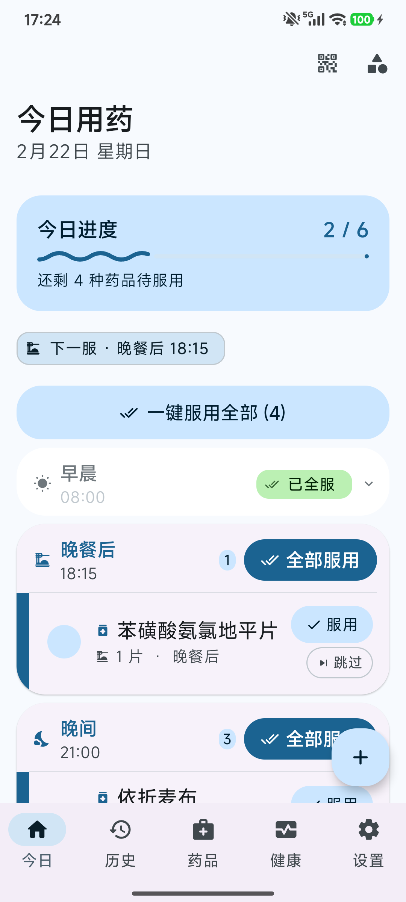
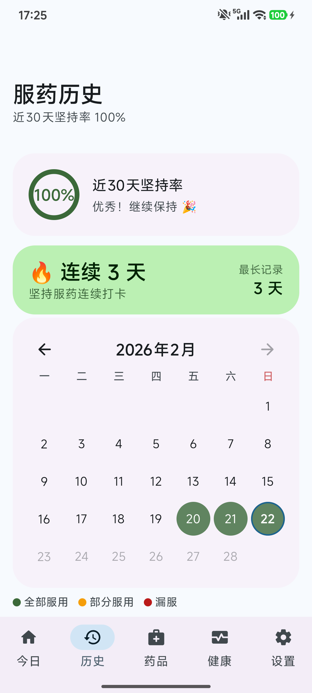
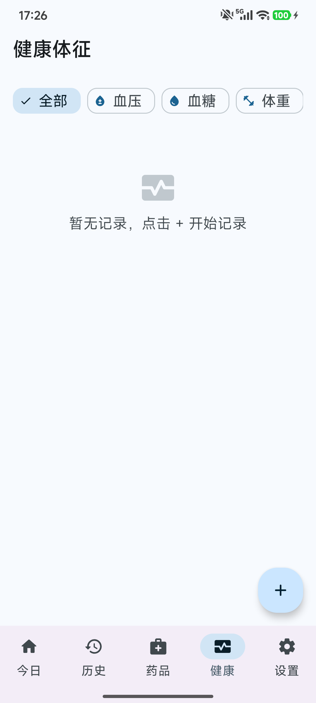
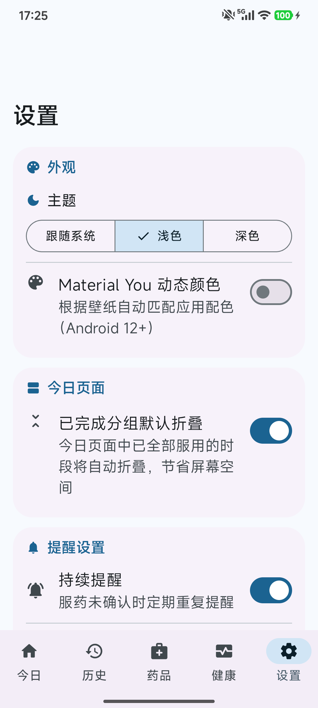

# Anshin 安心

<p align="center">
  <strong>A personal medication tracker that follows your daily rhythm.</strong><br>
  <em>安心 · 安心 · 안심 — Peace of mind, in every dose.</em>
</p>

<p align="center">
  <a href="https://github.com/Tinnci/anshin/actions/workflows/build.yml">
    
  </a>
  <a href="https://github.com/Tinnci/anshin/releases/latest">
    
  </a>
  
  
  
  
</p>

> **Anshin** (*an-shin*) — *Adherence & Notification System for Health Intelligence*
> 中文：安心用药，不再遗忘 · 日本語：安心して服薬管理 · 한국어：안심하고 복약 관리

A native Android app built with **Kotlin · Jetpack Compose · Material 3 Expressive**,
helping users track daily medication, manage inventory, and stay on schedule with precise alarms.

---

## Features

| Feature | Description |
|---------|-------------|
| **Onboarding** | 6-page spring-animated guide — routine times, feature toggles, theme selection |
| **Today's Doses** | Dashboard with per-period grouping, progress ring, one-tap mark-all, auto-collapse |
| **Status Tracking** | Taken / Skipped / Undo per dose with automatic stock deduction & restoration |
| **Precise Reminders** | AlarmManager exact alarms; direct Taken / Skip actions in the notification |
| **Routine-based Timing** | 11 fuzzy time periods (morning, before/after meals, bedtime…) mapped to personal schedule |
| **PRN (As-Needed)** | Separate section for on-demand medications with interval tracking |
| **History & Heatmap** | 90-day scrollable log; calendar heatmap with daily adherence rates |
| **Streak Tracking** | Current & longest adherence streaks displayed on the home screen |
| **Medication Management** | Add / Edit / Archive / Delete; dose, form, frequency, category, notes |
| **Stock Tracking** | Inventory counter + refill threshold; proactive low-stock banner alert |
| **Health Records** | Blood pressure, blood sugar, weight, temperature logging with trend charts |
| **Symptom Diary** | Daily symptom & side-effect journaling with preset quick-picks |
| **Drug Database** | Browse 7,000+ Chinese/TCM drug catalog for quick medication adding |
| **Interaction Check** | Automatic multi-drug co-administration risk detection with severity levels |
| **QR Share** | Export today's status or full medication plan as QR code for backup / sharing |
| **Plan Import** | Scan QR to import another user's medication plan (merge or replace) |
| **Homescreen Widgets** | Three Glance widgets — Today overview, Next dose, Streak counter |
| **Adaptive Layout** | Phone → Tablet → Desktop auto-switching (bottom bar / rail / drawer) |
| **Alarm Recovery** | All alarms re-scheduled after reboot via `BootReceiver` |
| **Travel Mode** | Keep hometown-timezone reminders when traveling across time zones |
| **Personalization** | Routine times, early reminder offset, persistent reminder, dark/light/auto theme, dynamic color |
| **i18n** | Full Chinese / English / Japanese / Korean support (567 string resources) |

---

## Screenshots

<p align="center">
  
  
  
</p>
<p align="center">
  
  
  
</p>

---

## Tech Stack

| Layer | Technology |
|-------|-----------|
| Language | Kotlin 2.2.10 |
| Build | Gradle 9.3.1 · AGP 9.1.0 · KSP 2.3.6 |
| UI | Jetpack Compose (BOM 2026.02.00) · Material 3 Expressive 1.5.0-alpha14 |
| Adaptive Nav | `material3-adaptive-navigation-suite` 1.2.0 |
| State | Kotlin Coroutines 1.10.2 · StateFlow · `collectAsStateWithLifecycle` |
| Database | Room 2.8.4 (KSP, 10 migrations) |
| Preferences | Jetpack DataStore 1.2.0 |
| DI | Hilt 2.59.1 + HiltViewModel |
| Background | WorkManager 2.11.1 + AlarmManager (exact) |
| Navigation | Navigation Compose 2.9.7 (type-safe serialized routes) |
| Widgets | Glance 1.1.1 (Compose-based homescreen widgets) |
| Camera / QR | CameraX 1.4.2 · ML Kit Barcode 17.3.0 · ZXing 3.5.3 |
| Animation | `Animatable` · Spring/tween physics · `AnimatedVisibility` · `MotionScheme` |
| Code Quality | ktlint 12.3.0 · Android Lint (zero warnings) · EditorConfig |
| Testing | JUnit 4 · Mockito-Kotlin 5.2.1 · Turbine 1.2.0 |
| Min / Target SDK | 26 / 36 |

---

## Architecture

**Clean Architecture + MVVM + SSOT (Single Source of Truth)**

```
┌──────────────────────────────────────────────────┐
│  UI Layer                                        │
│  Compose Screens  ←→  ViewModels (BaseViewModel) │
│                        ↑ StateFlow<UiState>      │
├──────────────────────────────────────────────────┤
│  Domain Layer                                    │
│  ToggleMedicationDoseUseCase                     │
│  ResyncRemindersUseCase · ImportPlanUseCase       │
│  ProgressNotificationUseCase · StreakCalculator   │
│  DateUtils · PlanExportCodec                     │
├──────────────────────────────────────────────────┤
│  Data Layer                                      │
│  Room DAOs · RepositoryImpl · DataStore          │
│  TransactionRunner · DrugDataSource              │
└──────────────────────────────────────────────────┘
```

**Key patterns:**

- **SSOT**: `SettingsPreferences` is the single source of truth for all user preferences. All ViewModels read from `UserPreferencesRepository.settingsFlow`.
- **TransactionRunner**: Abstraction over Room transactions for domain-layer testability.
- **BaseViewModel**: Shared `safeLaunch` with error handling for all ViewModels.
- **UI/Data separation**: `TimePeriod` is a pure enum (no Compose deps); UI extensions live in `ui/util/TimePeriodUi.kt`.

**Adaptive navigation** auto-selects based on `WindowWidthSizeClass`:

| Screen Width | Navigation Component |
|-------------|----------------------|
| Compact | `BottomNavigationBar` |
| Medium | `NavigationRail` |
| Expanded | `PermanentNavigationDrawer` |

---

## Project Structure

```
app/src/main/java/com/example/medlog/
├── data/
│   ├── local/          # Room DAOs · Database · TypeConverters · TransactionRunner · DataStore
│   ├── model/          # Medication · MedicationLog · TimePeriod · HealthRecord · SymptomLog · Drug
│   └── repository/     # Repository interfaces + Impl (Medication / Log / Health / Symptom / Drug / UserPrefs)
├── di/                 # Hilt AppModule (all bindings, migrations, TransactionRunner)
├── domain/             # Use cases · DateUtils · StreakCalculator · PlanExportCodec
├── interaction/        # InteractionRuleEngine (drug co-administration checks)
├── notification/       # NotificationHelper · AlarmScheduler · BootReceiver · AlarmReceiver
├── ui/
│   ├── components/     # MedicationCard · ProgressHeader
│   ├── navigation/     # NavGraph · Adaptive navigation (bottom bar / rail / drawer)
│   ├── qr/             # QrScannerPage (CameraX + ML Kit)
│   ├── screen/         # welcome / home / history / drugs / symptom / health / detail / addmedication / settings
│   ├── theme/          # Color · Type · Shapes · Theme (M3 Dynamic Color)
│   ├── util/           # DoseFormat · FormIcons · TimePeriodUi
│   └── utils/          # QrCodeUtils · OemWidgetHelper
├── util/               # ReminderTimeUtils
└── widget/             # Glance widgets (Today / NextDose / Streak) · WidgetRefreshWorker
```

---

## Getting Started

### Prerequisites

- **JDK 21** (required by Gradle 9.3.1)
- **Android SDK 36** (build-tools 36.0.0)
- **Android Studio** Meerkat 2024.3.2+ (or command-line only)

### Build

```bash
# Clone
git clone https://github.com/Tinnci/anshin.git
cd anshin

# Create local.properties (auto-detected if using Android Studio)
echo "sdk.dir=/path/to/android-sdk" > local.properties

# Build debug APK
./gradlew assembleDebug

# Install on device/emulator
./gradlew installDebug

# Run unit tests
./gradlew test
```

### Release Signing

See [.github/SIGNING.md](.github/SIGNING.md) for full setup.

**Quick summary:**
- Local: `local.properties` with `KEYSTORE_PATH`, `KEYSTORE_PASSWORD`, `KEY_ALIAS`, `KEY_PASSWORD`
- CI: GitHub Secrets (`KEYSTORE_BASE64`, `KEYSTORE_PASSWORD`, `KEY_ALIAS`, `KEY_PASSWORD`)
- Missing keys: graceful fallback to unsigned APK

```bash
# macOS one-liner (iCloud Drive + Keychain)
./scripts/setup-signing.sh
```

---

## Code Quality

```bash
./gradlew ktlintCheck    # lint check
./gradlew ktlintFormat   # auto-fix
./gradlew lintDebug      # Android Lint (report: app/build/reports/lint-results-debug.html)
```

**Current status:** 0 compile warnings · 0 lint errors · 0 lint warnings · all unit tests passing.

### Pre-commit / Pre-push Hooks

```bash
./setup-hooks.sh    # run once
# git commit → runs ktlintCheck automatically
# git push   → runs lintDebug automatically
```

---

## CI / CD

| Workflow | Trigger | Steps | Artifact |
|----------|---------|-------|---------|
| [CI Build](.github/workflows/build.yml) | push / PR to `master` | ktlint → test → lint → build | Debug APK |
| [Release](.github/workflows/release.yml) | push `v*.*.*` tag | ktlint → test → lint → sign → build → release | Signed APK + GitHub Release |

**Release flow:**

```bash
git tag v1.2.0
git push origin v1.2.0   # triggers Release workflow
```

The release workflow automatically:
1. Extracts `versionName` / `versionCode` from the tag (`major×10000 + minor×100 + patch`)
2. Decodes the Keystore from `KEYSTORE_BASE64` secret
3. Runs ktlint, unit tests, and lint
4. Builds a signed release APK (or unsigned if secrets missing)
5. Generates changelog from commits since last tag
6. Creates a GitHub Release with the APK attached

Pre-release tags (`-rc`, `-beta`, `-alpha`) are automatically marked as GitHub pre-releases.

---

## Internationalization

| Locale | Status | Resource Count |
|--------|--------|---------------|
| 🇨🇳 Chinese (default) | ✅ Complete | 567 |
| 🇬🇧 English | ✅ Complete | 567 |
| 🇯🇵 Japanese | ✅ Complete | 566 |
| 🇰🇷 Korean | ✅ Complete | 567 |

All Compose screens are fully extracted — zero hardcoded strings in UI files.
Resources include `<string>`, `<plurals>`, and `<string-array>` entries.

> **Contributions welcome:** To translate Anshin into your language,
> open an issue or PR with `app/src/main/res/values-{lang}/strings.xml`.

---

## Contributing

Contributions are welcome in any language.

1. Fork → feature branch → PR
2. Pass `ktlintCheck` and `lintDebug` before submitting
3. Follow the existing MVVM + SSOT + Clean Architecture patterns
4. Add unit tests for new domain/ViewModel logic

---

## License

```
Copyright 2025 tinnci

Licensed under the Apache License, Version 2.0 (the "License");
you may not use this file except in compliance with the License.
You may obtain a copy of the License at

    https://www.apache.org/licenses/LICENSE-2.0

Unless required by applicable law or agreed to in writing, software
distributed under the License is distributed on an "AS IS" BASIS,
WITHOUT WARRANTIES OR CONDITIONS OF ANY KIND, either express or implied.
See the License for the specific language governing permissions and
limitations under the License.
```
