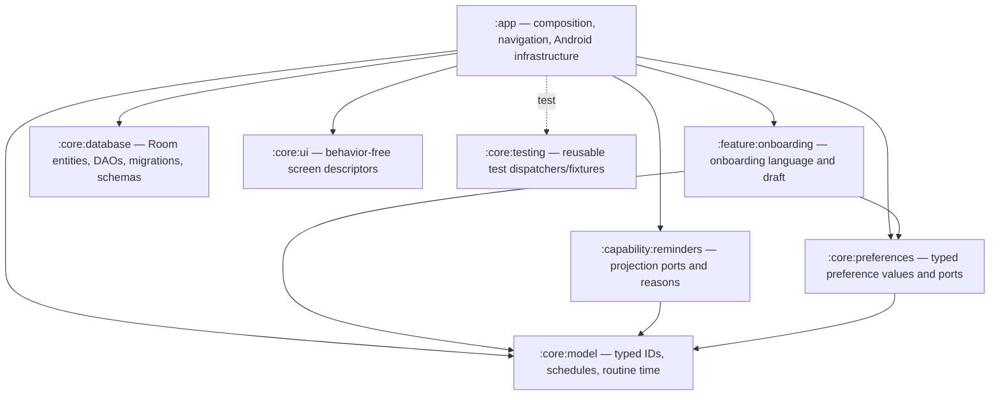

# Architecture governance

This document is the architectural contract for Anshin. It describes the code that is shipping, the dependency rules enforced by Gradle, and the criteria for future extraction. It is not a migration diary.

## Architecture decision

Anshin is a modular monolith using page-level MVVM with unidirectional data flow (UDF). Room and DataStore are the durable sources of truth. AlarmManager alarms, notifications, and Glance widgets are rebuildable projections of that truth.

There is deliberately no application-wide Redux store. Each complex route owns a focused state holder:

- `UiState` is an immutable snapshot of persistent, derived, and recoverable draft state.
- `UiAction` is the only ViewModel command entry point used by Content composables.
- `UiEffect` is used only for one-time delivery such as navigation, restart, or a snackbar. Effects use buffered channels rather than replay-sensitive shared flows.
- Route composables own Hilt lookup, lifecycle collection, navigation, permissions, Activity Results, and other Android adapters.
- Content composables receive immutable state and callbacks and do not know about ViewModels.

Simple leaf composables remain stateless functions. A reducer or state machine is added only when a flow has meaningful transitions, such as onboarding, medication editing, OCR, cloud AI, or BPX1 connection/import.

## Module and layer map



Gradle project dependencies enforce the direction: a core or capability module cannot import app implementation code because it is not on that module's compile classpath. `:app` is the composition root and the only module allowed to assemble Android entry points and infrastructure implementations.

The stable ownership boundaries are:

| Boundary | Owns | Must not own |
|---|---|---|
| `core:model` | `MedicationId`, `DoseOccurrenceId`, typed schedules, routine clock values, date/streak/reminder planning | Android, Room, Compose, Hilt |
| `core:database` | Room entities, DAOs, converters, database identity/version, every migration, exported schemas | repositories, UI, or feature policy |
| `core:preferences` | typed values, focused preference states, focused read/write ports | DataStore keys or Android context |
| `core:ui` | serializable/behavior-free screen chrome descriptions | ViewModels, repositories, action closures |
| `core:testing` | reusable coroutine/JUnit support | production behavior |
| `feature:onboarding` | onboarding draft language | DataStore and reminder implementations |
| `capability:reminders` | reminder projection ports and reconciliation reasons | AlarmManager implementation |
| `app` | composition/navigation, repositories, DataStore, Keystore, network, AlarmManager, notification, Glance, OCR, and BLE adapters | new cross-feature domain rules or duplicate persistence ownership |

Pure calculations live in the Kotlin-only `:core:model`, so Android, Room, Compose, and Hilt imports fail at compilation. Commands, queries, and orchestration live next to their owner under `feature/*/application` or `capability/*/application`. Infrastructure is grouped under `data` or a platform boundary such as `capability/reminders`, `capability/widgets`, `capability/ai`, `capability/ocr`, and `capability/bpx1`; Hilt wires these at the composition root. Presentation is organized as vertical slices under `feature/medications`, `feature/history`, `feature/health`, `feature/settings`, and `feature/onboarding`.

## Truth, commands, and projections

Room owns medications, dose occurrences/logs, stock, health records, symptoms, and AI audit/cache records. DataStore owns preferences and onboarding completion. External UI surfaces never become independent business truth.

All dose entry points—Compose UI, notification actions, and Glance actions—invoke the same application command. A dose occurrence is identified by `DoseOccurrenceId(MedicationId, scheduledAt)`. The Room unique index and transactional repository mutation make retries and concurrent delivery idempotent: a repeated command cannot add another log or apply another inventory delta.

Reminder reconciliation follows this sequence:

1. Commit the business transaction to Room or DataStore.
2. Reconcile the affected medication or all medications from current truth.
3. Always enqueue a durable WorkManager retry, including when the immediate projection call fails.
4. Rebuild after application start, boot, package replacement, time/timezone change, permission recovery, onboarding routine changes, or restore.

Projection failure does not roll back committed truth or report an ambiguous half-success. Reconciliation is idempotent, so the durable retry safely converges alarms, notifications, and widgets.

## Persistence compatibility

`DatabaseSchema.VERSION` is the single compile-time authority for Room and backup compatibility. Exported Room schemas remain checked in. A release that changes Room entities must:

1. increment `DatabaseSchema.VERSION`;
2. add an explicit migration and retain every historical migration path;
3. export the new schema JSON;
4. extend migration and backup/restore tests;
5. never reinterpret existing columns through UI-only models.

Legacy string fields such as `frequencyType`, `frequencyDays`, `timePeriod`, and `reminderTimes` remain persistence encodings for compatibility. `MedicationScheduleMapper` is the adapter seam; planning and command code use `MedicationSchedule`, `ScheduleRecurrence`, `RoutineAnchor`, and `java.time` values instead.

Time-sensitive logic accepts `Clock` and explicit zones. Tests cover daylight-saving gaps/overlaps, travel-zone resolution, historical entry, and deterministic "now" behavior.

## Preference governance

The DataStore file remains one atomic storage unit, while consumers depend on focused ports:

- `AppearancePreferences`
- `ReminderPreferences`
- `FeaturePreferences`
- `AiPreferences`
- `WidgetPreferences`
- `OnboardingPreferences`

Each port exposes a typed, `distinctUntilChanged` Flow so unrelated key edits do not cause feature-wide recomputation. Cross-field updates use one DataStore edit. `CompleteOnboardingUseCase` validates and atomically stores the complete draft, resynchronizes routine-anchored plans, reconciles reminders, and only then exposes completion. `SavedStateHandle` preserves the page and draft across recreation and guards duplicate submission.

## Extraction criteria

A new Gradle module is justified only when the boundary has at least one of these properties:

- a stable domain language and API;
- multiple consumers or platform entry points;
- meaningful isolation from Android/vendor dependencies;
- independently valuable tests;
- measurable build isolation.

One screen is not one module. Presentation packages may remain in `:app` until their resources and Android adapters can move without introducing reverse dependencies. The first extraction deliberately keeps repositories in `:app` while `:core:database` owns the complete Room implementation. This preserves one persistence boundary without forcing feature policy or application commands into the database module.

## Verification gates

Before merging a change, run the gates proportional to risk. Architecture migrations and releases run the full set:

```bash
./gradlew ktlintCheck test assembleDebug compileDebugAndroidTestKotlin
./gradlew :core:database:compileDebugAndroidTestKotlin
./gradlew lintDebug assembleRelease
```

The suite covers model invariants, schedule/DST behavior, idempotent dose and inventory transitions, reminder convergence, focused repository contracts, ViewModel action-to-state/effect behavior, Room history migrations, backup compatibility, and UI/Widget/notification entry-point consistency. Instrumented migration and Compose tests require an Android SDK/device environment but must always compile in CI.

## ADRs

### ADR-001 — MVVM plus UDF, no global store

Accepted. Feature-local state and actions provide deterministic rendering and testability without coupling unrelated screens through a global reducer.

### ADR-002 — Room/DataStore are truth; platform surfaces are projections

Accepted. AlarmManager, notifications, and widgets are disposable and must be reproducible by an idempotent reconciler.

### ADR-003 — Stable occurrence identity at the transaction boundary

Accepted. Medication ID plus scheduled instant is the identity for a planned dose. Database uniqueness and atomic mutation are the final concurrency guard.

### ADR-004 — Typed schedules over persistence strings

Accepted. Historical database fields remain intact, but interpretation is isolated to a mapper and business rules consume sealed typed schedules.

### ADR-005 — Focused preference ports over a settings god object

Accepted. One DataStore remains operationally useful; narrow interfaces prevent accidental coupling and unnecessary Flow invalidation.

### ADR-006 — Coarse, evidence-based modules

Accepted. Core contracts and cross-entry capabilities are modules; screens are grouped by business feature and extracted only after stable seams exist.

### ADR-007 — Room implementation belongs to one core database module

Accepted. Entities, DAOs, converters, migrations, schema exports, and migration tests move together. Repository interfaces and application policy stay outside, preventing both schema duplication and a generic “data” module that owns business decisions.

### ADR-008 — Feature-first packages precede feature modules

Accepted. Stable vertical packages establish ownership first. A feature becomes a Gradle module only when its resources, entry adapters, domain language, and tests form a useful independent build boundary; package names are not treated as dependency enforcement.
