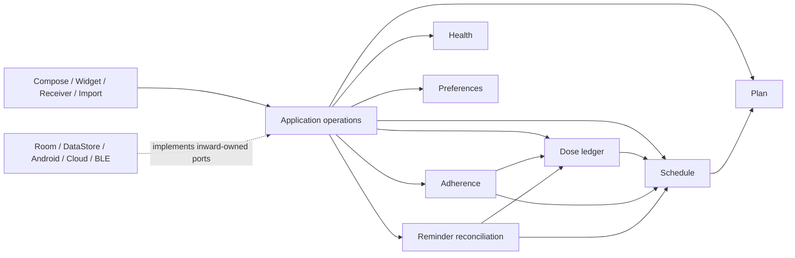

# Architecture Governance

This is the maintained architecture backlog for Anshin. It keeps decisions,
reproduced evidence, and exit criteria together without duplicating detailed
implementation plans.

Snapshot: 2026-07-26.

## How to use this document

Order candidates by:

1. persisted-data and clinical-safety risk;
2. contradictory user-visible facts;
3. recovery after interruption or process death;
4. number of consumers that can stop owning the same rule;
5. migration cost and reversibility.

States:

- `suspected`: code reading only;
- `confirmed`: reproduced or contradicted by authoritative state;
- `designing`: invariants and target interface are under review;
- `implementing`: production work is in progress;
- `verifying`: implementation exists but its full evidence is incomplete;
- `resolved`: exit criteria pass and duplicate knowledge is removed;
- `deferred`: postponed with a recorded reason.

An architecture change must make a module deeper: callers receive a smaller
interface while more policy moves behind it. Package moves, forwarding
repositories, and one-method wrappers do not count.

## Ranked backlog

| ID | Priority | State | Capability | Confirmed evidence | Next gate |
|---|---|---|---|---|---|
| DOSE-1 | P0 | confirmed | Atomic dose-result ledger | Duplicate and cross-result transitions can apply inventory twice; undo cannot reliably reverse the original quantity | Approve planned-dose identity, transition table, consumed-quantity snapshot, and audit semantics |
| SCHEDULE-1 | P0 | confirmed | One versioned plan and occurrence projection | Home, History, reminders, and widgets interpret anchors, dates, slots, and DST differently | Approve schedule algebra, zone policy, edit-effective boundary, and occurrence identity |
| REMINDER-1 | P0 | confirmed | Persisted desired-state reconciliation | Database commits and Android alarms can diverge; archive can leave self-renewing alarms; startup does not reconcile | Persist reminder intent and make scheduling, cleanup, and recovery idempotent |
| BACKUP-1 | P0 | confirmed | Versioned atomic backup and restore | Current backups can reject their own schema version; unrelated SQLite files pass weak preflight; DataStore is absent from “all data” | Adopt a manifest-based logical package and staged restore |
| IMPORT-1 | P0 | confirmed | Validated staged plan import | Multi-slot round trips duplicate plans; REPLACE can cascade-delete history; interrupted imports leave partial state | Decode to a proposal, resolve conflicts, commit atomically, and emit a receipt |
| WIDGET-1 | P0 | confirmed | Occurrence-based widget projection and actions | Widgets collapse daily slots, accept stale medication-only actions, and compute completion differently | Use one occurrence snapshot and an idempotent action protocol |
| PRIVACY-1 | P0 | confirmed | Explicit data collection, egress, retention, display, and deletion | Copy says images are not uploaded while cloud OCR sends pixels; secret drafts enter saved state; surface privacy differs | Correct disclosure and introduce purpose-bound egress, secret storage, retention, and safe projections |
| VOICE-1 | P0 | confirmed | Session-owned voice capture | One process singleton broadcasts transcripts to multiple ViewModels; leaving a screen does not reliably stop capture | Introduce exclusive owner leases, targeted events, and atomic stop/join |
| INTERACTION-1 | P0 | confirmed | Evidence-versioned medication knowledge | Substring class matching creates false high/moderate alerts; 31 unsourced rules front 11,339 products; coverage is invisible | Narrow the safety claim, resolve ingredients, version evidence, and expose uncertainty |
| LOCALE-1 | P0 | confirmed | Supported-locale and clinical-message contract | Japanese and Korean each miss 65 of 952 resources; safety insights are raw Chinese; English OCR selects the Chinese recognizer | Declare supported paths and bind messages, OCR, ASR, and AI to locale |
| MIGRATION-1 | P1 | confirmed | Reproducible schema and semantic migrations | Only schemas 12–15 exist for a 5→15 chain; the committed v15 hash was stale; legacy OCR rows become `MANUAL`; legacy log creation becomes epoch zero | Use generated immutable schemas, real fixtures, migration tests, and explicit unknown semantics |
| ADHERENCE-1 | P1 | confirmed | One multidimensional adherence projection | The same data yields about 3% in History and 100% in Detail; a partial dose changes only one streak | Define recording, quantity, timing, and engagement separately |
| TIME-1 | P1 | confirmed | Typed temporal context | DST differs by one hour across consumers; date ranges cross midnight; History uses UTC modulo for local day end | Adopt `java.time` types, frozen clocks, zone/DST policy, and monotonic deadlines |
| MODEL-1 | P1 | confirmed | Validated domain concepts | Entities and imports admit contradictory/non-finite plans; unknown persisted values are silently reinterpreted | Separate compatibility rows from typed validated models and repair outcomes |
| SETTINGS-1 | P1 | confirmed | Capability-owned preferences | A theme edit restarts health analysis; 55 keys and route-wide ViewModels mix unrelated effects | Add typed projections and explicit change/reconciliation commands |
| HEALTH-1 | P1 | confirmed | Health capture, assessment, and analysis | OCR confidence exceeds its scale; edit can overwrite identity; BP authority conflicts; device pairs are non-atomic; cloud can replace local safety findings | Agree on reading identity, validation, confidence, provenance, safety authority, and idempotency |
| RESILIENCE-1 | P1 | confirmed | Typed failure and recovery contracts | User writes can fail silently; core flows log and terminate; widgets suppress all refresh failures | Define capability failures, honest operation state, retry policy, and redacted diagnostics |
| LIFECYCLE-1 | P1 | confirmed | External-command and draft ownership | A History shortcut does nothing; add commands can replay; no ViewModel uses `SavedStateHandle`; widget config returns success before commit | Add typed one-shot commands, classified draft state, and completion receipts |
| TEST-1 | P1 | confirmed | Risk-aligned verification | Source-text guards dominate structural assertions; Room, migration, lifecycle, and platform boundaries are under-tested | Add adapter contracts and migration/platform lanes, then delete source-shape guards |
| REPOSITORY-1 | P2 | confirmed | Capability command/query ports | Four repositories mirror 37 DAO methods; fakes disagree on ranges, ordering, conflicts, and rollback | Replace mirrors only while extracting a capability and share adapter contracts |

## Architecture direction

Use a capability-oriented modular monolith. Keep one Android `:app` module
until dependency direction is enforceable; extract Gradle modules only after a
stable interface exists.



Boundary rules:

- plan, schedule, dose, adherence, and health policy import no Android,
  Compose, Room, Hilt, widget, notification, or UI types;
- application operations depend on inward-owned ports, never concrete Android
  delivery classes;
- Room entities, DataStore preferences, import DTOs, and provider responses
  stop at adapter boundaries;
- the DI composition root may see both sides but contains no product policy;
- a new cross-capability dependency requires an explicit contract and an
  update here;
- do not create a generic `core` dumping ground.

The first plausible extractions are pure Kotlin/JVM `schedule-core`, then
`dose-core` or `health-assessment`. UI features, Room, and Android scheduling
remain in `:app` until their seams are proven.

## Non-negotiable product invariants

1. A planned dose has one stable identity across reminders, actions, history,
   adherence, and widgets.
2. A dose-result transition and its inventory effect commit once or not at all.
3. Persisted desired external state converges after restart, retry, time change,
   permission change, package replacement, and restore.
4. Import and restore validate before mutation and never destroy history as an
   accidental conflict-resolution side effect.
5. Safety output exposes evidence, coverage, uncertainty, locale, and
   provenance; absence of a known rule is not proof of safety.
6. Sensitive data leaves the device only for a disclosed, consented purpose
   through an approved endpoint and bounded transport.
7. Historical unknowns remain unknown. Migrations must not invent provenance,
   timestamps, confirmation, or clinical meaning.
8. Every visible success means the owning commit completed, not merely that a
   coroutine was launched.

## Capability evidence and exit criteria

### Medication plan, schedule, dose, reminder, and adherence

**DOSE-1**

- Evidence: duplicate take, take→skip, partial-dose, undo, stale stock, and
  concurrent transition scenarios produce non-conserving inventory effects.
- Target: `transition(plannedDoseId, expectedRevision, result)` owns
  uniqueness, previous result, consumed quantity, inventory delta, and receipt.
- Exit: retries and races are idempotent; undo uses the committed snapshot;
  every consumer stops writing logs and stock separately.

**SCHEDULE-1**

- Evidence: recurrence fields form invalid combinations; consumers choose
  different anchors and date inclusivity; local wall times are used as IDs.
- Target: validated recurrence variants plus a single range/next-occurrence
  projection with explicit zone and DST resolution.
- Exit: one golden plan yields identical ordered occurrences in Home, History,
  reminders, widgets, and adherence across DST and edit boundaries.

**REMINDER-1**

- Evidence: Room and `AlarmManager` have no shared commit; identifiers collide;
  archive and reboot recovery depend on best-effort caller behavior.
- Target: durable desired-delivery rows, deterministic platform identity, a
  reconciler, delivery-time validation, and retryable dirty state.
- Exit: fault injection after every database/platform phase converges without
  duplicate or orphan delivery.

**ADHERENCE-1**

- Evidence: consumers use different denominators, date windows, and meanings
  for partial/skipped/late doses.
- Target: a projection that reports recording completeness, quantity
  implementation, timing, and streak policy separately.
- Exit: all surfaces consume the same typed report; no independent percentage
  or streak algorithm remains.

### Transfer and external surfaces

**BACKUP-1 / IMPORT-1**

- Evidence: raw-file backup couples compatibility to Room internals; preflight
  is weak; import mutates while decoding and conflates plan replacement with
  historical deletion.
- Target: versioned manifest, hashes, coverage declaration, proposal preview,
  staged validation, atomic commit or recoverable swap, and a durable receipt.
- Exit: corrupt, foreign, interrupted, duplicate, and old-version fixtures
  fail safely; successful restore/import requests reminder/widget
  reconciliation exactly once.

**WIDGET-1**

- Evidence: state and actions are medication-scoped while the UI represents
  occurrences; per-widget configuration is stored globally and commits
  asynchronously.
- Target: privacy-filtered occurrence snapshot, occurrence action key,
  per-instance configuration, and refresh dirty marker.
- Exit: stale actions are rejected, multiple slots remain distinct, completion
  agrees with the app, and configuration returns success only after commit.

### Health, voice, interaction knowledge, locale, and privacy

**HEALTH-1**

- Evidence: local OCR confidence can be `1.10`; cloud and local scores share an
  undefined scale; correction retains proposal provenance; camera failure can
  leave processing stuck; stale cloud work can overwrite retry; BPX1 auto-save
  marks data confirmed and writes BP/HR non-atomically.
- Target: three boundaries:
  `CaptureProposal` (raw observation), `HealthDecision` (validated user/device
  decision), and `HealthReadingBundle` (atomic persisted facts). Deterministic
  safety assessment is preserved when optional analysis fails.
- Exit: identity, confidence, confirmation, source, and atomicity tests pass
  for manual, local OCR, cloud OCR, import, and device replay.

**VOICE-1**

- Evidence: a global session and broadcast flow allow transcript leakage and
  overlapping starts/stops.
- Target: an exclusive lease bound to owner, purpose, consent version, locale,
  and target; ordered targeted events; stop waits for resource release.
- Exit: two-owner, navigation-away, denial, provider-failure, and process-loss
  tests prove no cross-delivery or microphone leak.

**INTERACTION-1**

- Evidence: broad substring rules create deterministic false positives; rules
  lack stable ingredient identity and reviewed evidence metadata; empty and
  failed catalogs look alike.
- Target: normalized ingredient/product IDs, applicability constraints,
  evidence-versioned rule packs, coverage state, and localized findings.
- Exit: reviewed positive/negative/unknown fixtures pass, asset failures are
  visible, and UI claims do not exceed assessed coverage.

**LOCALE-1**

- Evidence: advertised resource sets are incomplete; policy returns raw
  Chinese prose; OCR/ASR/provider metadata use conflicting locale defaults.
- Target: declared supported locale/capability matrix; policy returns semantic
  message codes with typed arguments; adapters consume one `LocaleContext`.
- Exit: critical catalogs are complete in CI, clinical outputs match locale,
  units/dates/numbers are explicit, and unsupported recognizers fail honestly.

**PRIVACY-1**

- Evidence: full images may be sent where local OCR uses a crop; redirects and
  response sizes are not bounded consistently; recent-screen capture has no
  explicit posture; retention and deletion differ by surface.
- Target: data classification and purpose registry, versioned consent,
  allowlisted endpoint policy, credential vault, minimal projections,
  retention enforcement, and redacted diagnostics.
- Exit: egress tests enumerate destinations and payload class; consent and
  deletion tests cover every external surface; canary secrets/clinical text
  never appear in logs or retained transient state.

### Foundations, lifecycle, resilience, and seams

**TIME-1 / MODEL-1**

- Use `Instant`, `LocalDate`, `LocalTime`, `ZoneId`, and monotonic durations for
  their actual meanings; capture one temporal snapshot per operation.
- Convert compatibility rows into typed domain variants with structured
  validation or repair issues. Unknown enum/string values fail closed.
- Exit: property and table tests cover DST gaps/overlaps, midnight, invalid
  numeric values, legacy values, and encode/decode/migrate round trips.

**SETTINGS-1**

- Keep one physical DataStore initially.
- Expose typed capability projections and commands with declared effects.
- Exit: unrelated changes do not restart work; dead keys/UI are removed;
  callers no longer observe the whole preference snapshot.

**RESILIENCE-1 / LIFECYCLE-1**

- Replace log-and-default behavior with typed failure categories and operation
  states that distinguish idle, running, succeeded, retryable, and terminal.
- Route external intents through typed, identity-bearing commands; classify
  recoverable drafts; emit result only after the owning commit.
- Exit: flow resubscription, retry, recreation, process death, warm/cold intent,
  and commit-before-finish tests pass with privacy-safe diagnostics.

**REPOSITORY-1**

- Do not perform a repository rename campaign.
- Introduce capability command/query ports only when they hide transaction,
  ordering, range, conflict, validation, or recovery policy.
- Exit: real Room adapters and fast fakes pass the same semantic contract;
  entity CRUD mirrors and caller-owned transactions are deleted.

## Room migration governance

Room entities are the current-schema source of truth. Exported JSON schemas are
generated, immutable compatibility artifacts—not hand-edited design files.
The repository uses the Room Gradle plugin:

```kotlin
plugins {
    id("androidx.room")
}

room {
    schemaDirectory("$projectDir/schemas")
}
```

CI compiles the project and then fails if `app/schemas` differs from Git. This
keeps generated output reviewable without trusting a developer to copy or edit
it manually. Android's Room guidance recommends storing generated schema
history and using `MigrationTestHelper` to validate every migration path:

- <https://developer.android.com/training/data-storage/room/migrating-db-versions>
- <https://developer.android.com/reference/androidx/room/testing/MigrationTestHelper>

### Confirmed migration evidence

- Runtime database version is 15 and manual migrations cover 5→15.
- Authentic generated schemas are committed only for versions 12–15.
- The previously committed `15.json` contained the v14 identity hash even
  though its table structure included v15 columns. The public v1.18.3 APK and
  current generated runtime both use the correct v15 hash, so this is a stale
  repository artifact—not evidence of a universal production upgrade crash.
- OCR health capture existed before provenance columns. Migration 13→14 assigns
  every legacy row `source = 'MANUAL'`, inventing provenance that cannot be
  proven.
- Migration 14→15 assigns every legacy medication log `createdAtMs = 0`, which
  reads as 1970 if treated as an actual timestamp.

### Policy

1. Never edit an existing schema JSON or released migration to make a test
   pass. Regenerate the current snapshot; add a new version for new semantics.
2. Do not fabricate schemas 5–11 from current entities. Recover authentic
   release artifacts or sanitized databases, verify their origin, and define
   the oldest supported start version.
3. Every supported start version gets representative rows and a migration to
   current that validates schema and capability invariants.
4. Defaults introduced by migration use explicit `UNKNOWN`/nullable semantics
   when history cannot prove a value. UI and analysis must not reinterpret
   sentinels as real facts.
5. A schema change is incomplete until generated diff, migration tests, backup
   compatibility, rollback/recovery behavior, and post-migration decoding pass.

The first durable migration test covers the authentic 12→15 chain and verifies
that a legacy health row survives while Room validates the complete target
schema. It intentionally does not assert that invented provenance or epoch-zero
timestamps are correct. Follow-up work must introduce explicit legacy-unknown
semantics in a new database version.

## Verification strategy

| Layer | Purpose | Examples |
|---|---|---|
| L0 pure policy | Fast deterministic rules | schedule, transitions, adherence, time, validation, assessment |
| L1 application operation | Commit and recovery semantics | idempotency, expected revision, fault injection |
| L2 adapter contract | Production and fake parity | Room/DataStore, backup, endpoint, alarm/widget desired state |
| L3 Android lifecycle | Framework ownership | Activity recreation, Receiver/Worker, permissions, voice, widget config |
| L4 critical story | Cross-capability truth | plan→reminder→dose→history/widget; restore→reconcile; health capture |

Keep most tests at L0/L1. Use L2–L4 only where the real storage, process, or
Android contract is the behavior.

Source-shape tests are temporary unless they parse a stable structure or enforce
a dependency rule. Replace tests that require filenames, function names, line
counts, or call spelling with behavior, schema, manifest/XML, or dependency
checks.

CI lanes:

- fast PR: formatting, L0/L1, selected host adapter contracts, schema drift,
  lint, and debug build;
- affected emulator: database, navigation, receiver/worker, widget, voice,
  permission, and backup changes;
- main/nightly: supported API, locale, timezone/DST, process recreation, and
  full migration matrix;
- release: fast lane plus mandatory supported-migration and critical platform
  smoke tests before signing.

## Migration sequence

| Batch | Work | Exit evidence |
|---|---|---|
| 0 containment | Correct false disclosure and unsafe claims; close known duplicate/overwrite/silent-success paths | Focused regressions for each contained defect |
| 1 typed foundations | TIME-1, MODEL-1, authentic migration fixtures, plan and occurrence identity | Invalid, legacy, date, zone, and migration tables pass |
| 2 schedule seam | One occurrence range/next projection | All delivery surfaces agree on golden plans |
| 3 dose seam | Transactional transition and inventory ledger | Duplicate, race, cross-result, undo, and stale-revision tests pass |
| 4 external convergence | Reminder desired state and durable reconciliation | Restart/fault injection converges |
| 5 read convergence | Adherence and widgets consume occurrences/results | Counts, streaks, completion, and actions agree |
| 6 transfer/recovery | Staged import and manifest backup/restore | Atomic or resumable under every injected boundary |
| 7 independent deepening | Health, voice, interaction, locale, settings, resilience, lifecycle | Each capability's exit criteria pass and old paths are deleted |

TEST-1 is continuous enablement, not a final cleanup batch.

## Update discipline

For every iteration:

1. inspect current code and worktree before trusting this snapshot;
2. record a finding once, under the capability that owns the invariant;
3. distinguish reproduction, inference, and product decision;
4. remove claims disproved by stronger evidence;
5. write the target interface and failure semantics before moving packages;
6. add tests at that interface, including interruption and invalid inputs;
7. require deletion of old rules, wrappers, fixtures, flags, and source guards;
8. regenerate derived artifacts with their owning tool;
9. update state only after verification;
10. leave unrelated working-tree changes untouched.
