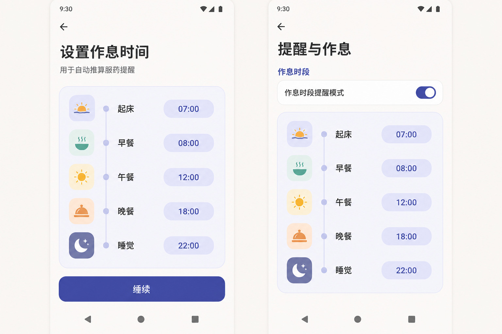
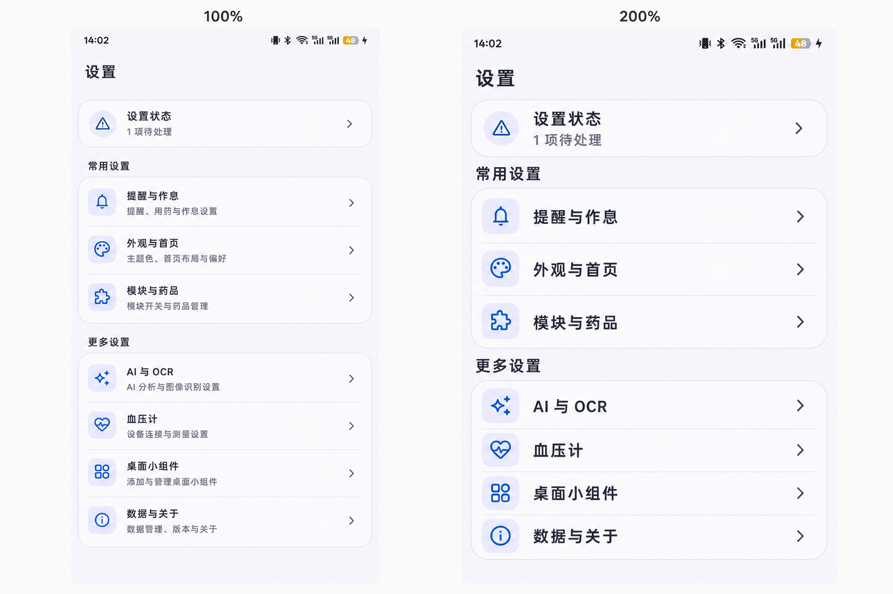

# Settings and routine UI proposals

These proposals are visual references for the Compose implementation. They are
not pixel-perfect specifications; Material semantics, localization, touch
targets, and accessible reflow take precedence.

## Anshin brand foundation

- The adaptive launcher icon is the canonical source for brand color and shape.
- Brand teal is `#0B5F63`; brand cream is `#F7EBD8`.
- First launch uses the Anshin palette. Material You remains available as an
  explicit preference instead of replacing the brand before the user chooses it.
- Splash, launcher, app shortcuts, onboarding brand mark, palette preview, and
  primary icon containers reuse these tokens or their accessible Material roles.
- Decorative icon containers use `primaryContainer` with `primary` content;
  semantic success, warning, and error states retain their distinct roles.

## Shared routine editor

- Welcome and Settings use one slot order and one editor component.
- A grouped timeline replaces duplicate summary chips and expanding inline
  time inputs.
- Each time remains a direct, accessible action with a 24-hour label.

Prompt summary: high-fidelity Material 3 Android screens showing an identical
five-slot routine timeline in Welcome and reminder settings, with compact icon
containers, time pills, and no accordion expansion.

## Responsive Settings hierarchy

- The home page contains status and category navigation only.
- Appearance and module controls live on dedicated routes.
- At constrained effective width or accessibility font scaling, navigation
  subtitles are removed while text size and touch targets are retained.
- Palette and display choices scroll horizontally instead of wrapping into a
  long vertical stack.

Prompt summary: side-by-side 100% and 200% accessibility layouts for a compact
Settings home, preserving category order and touch targets while reflowing
secondary content.

Both images were generated with the built-in image generation tool.
