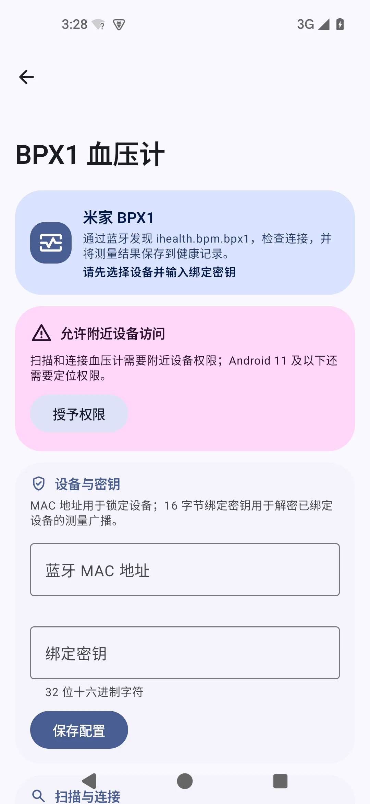
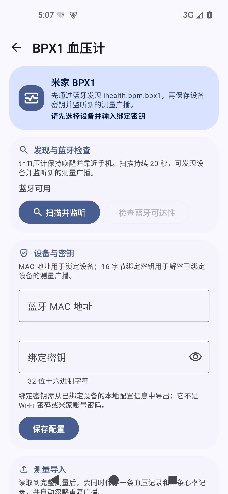
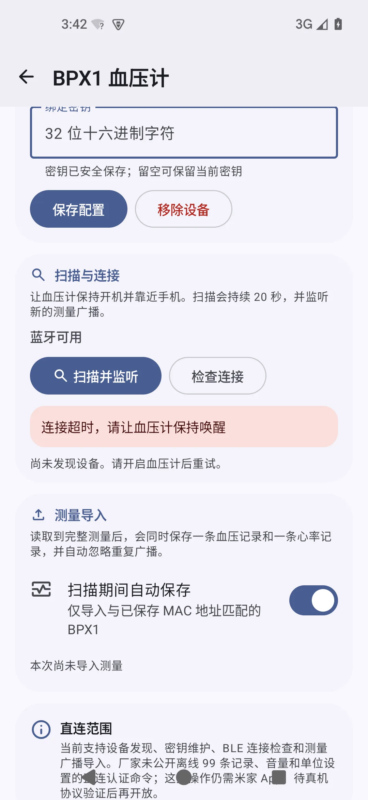
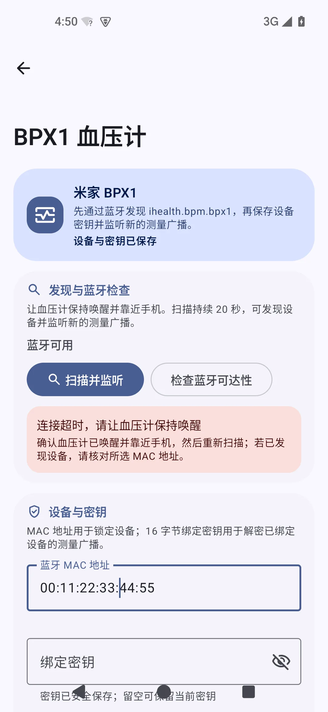
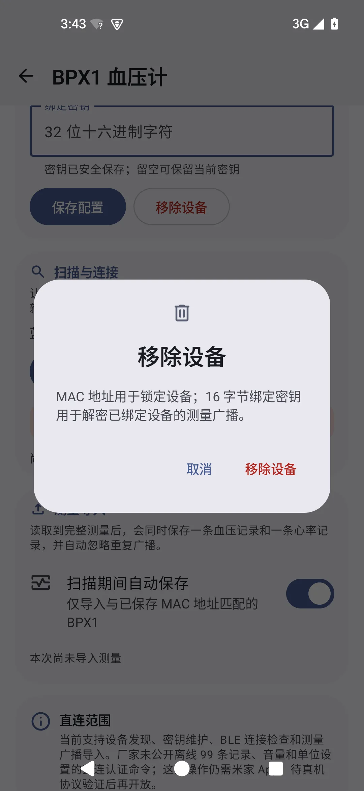
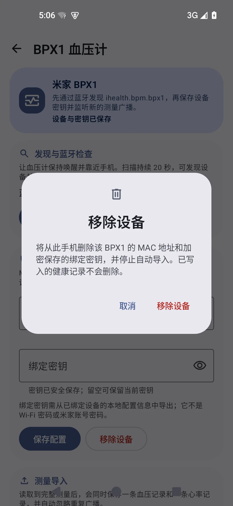
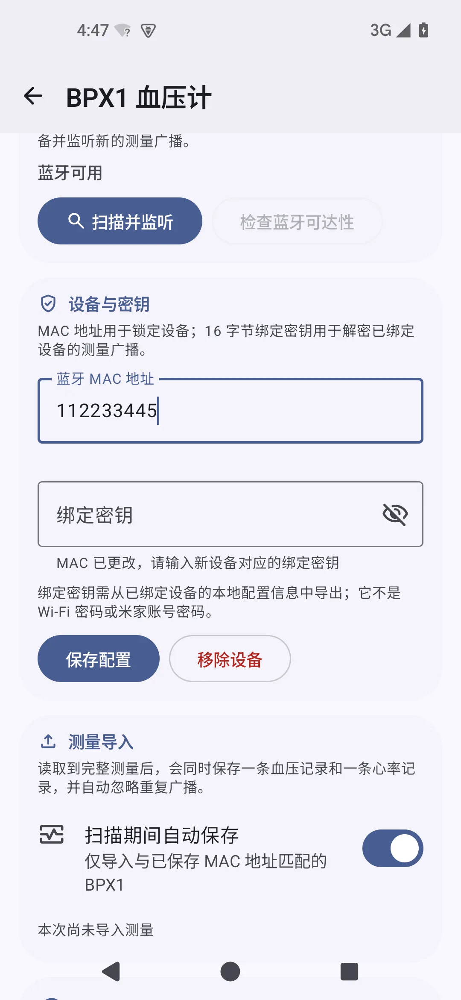
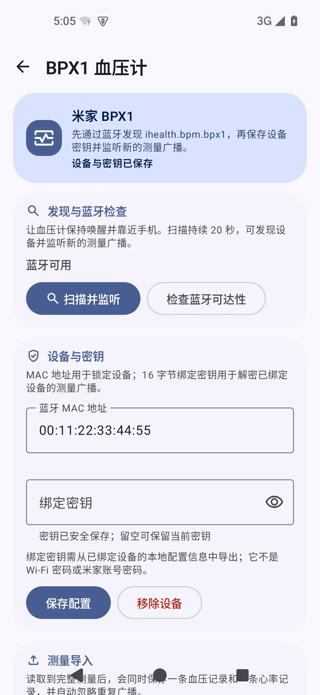

# BPX1 维护流程审计

完成时间：2026-07-19

验证环境：Android API 35、390 × 844 dp、简体中文、2 GB RAM / 2 vCPU 低内存 AVD

范围：`ihealth.bpm.bpx1` 的发现、配置、蓝牙可达性检查、自动导入与移除流程

## 总体结论

流程已由“先填写配置，再寻找设备”调整为符合用户心智的顺序，并把蓝牙可达性与绑定密钥验证明确区分。当前未发现阻断维护流程的 P0/P1 界面问题；真实设备通信与离线记录容量仍需硬件验证。

1. **进入与理解**：紧凑标题栏替代大标题，首屏可同时看到用途、扫描动作和配置入口。
2. **发现设备**：先扫描或检查权限；仅在完成过扫描后显示“尚未发现设备”，避免初始假失败。
3. **维护凭据**：设备行可整行选择，绑定密钥支持无障碍显示/隐藏；更换 MAC 时强制输入对应的新密钥。
4. **确认可达性**：“检查连接”改为“检查蓝牙可达性”，结果不再暗示绑定密钥已经验证，失败状态给出下一步操作。
5. **自动导入**：未保存有效配置时不可开启，并解释禁用原因。
6. **移除设备**：明确移除加密密钥、MAC 和自动导入设置，同时保留既有健康记录。

## 首屏层次

改造前的大标题和错误顺序让“扫描设备”落在首屏之外；改造后先发现设备，再维护 MAC 与绑定密钥。

| 改造前 | 改造后 |
| --- | --- |
|  |  |

## 结果与恢复动作

旧结果只报告连接失败，且“连接”容易被理解为已经完成认证。新结果准确描述 BLE/GATT 可达性，并给出保持设备唤醒、重新扫描和核对 MAC 的恢复顺序。

| 改造前 | 改造后 |
| --- | --- |
|  |  |

## 危险操作

移除确认现在同时说明会删除什么、会保留什么，降低用户误删健康记录的顾虑。

| 改造前 | 改造后 |
| --- | --- |
|  |  |

## 状态不变量

更换设备后不能沿用旧设备密钥；相同 MAC 可以保留已加密保存的密钥。该约束由界面提示、ViewModel 校验和存储层共同执行。

| 更换设备需要新密钥 | 已配置终态 |
| --- | --- |
|  |  |

## 验证边界

- AVD 没有物理 BPX1，因此截图只能证明界面层次、输入状态和失败恢复流程；不能证明真实 BLE 广播、GATT 服务、绑定密钥认证或离线记录导入。
- 单元测试覆盖 MAC/密钥格式、设备更换不变量、扫描状态和导入去重；真实硬件仍需覆盖权限拒绝、设备休眠、错误密钥、重复记录及 99 条历史记录边界。
- 证据使用虚拟 MAC 与测试密钥，不包含用户设备密钥或健康数据。
- 设置中心中的 BPX1 入口仍位于外观和首页配置之后，属于后续设置中心信息架构审计范围。

重新生成证据时应使用固定视口和同一语言环境；不要提交原始布局转储、中间迭代截图或真实设备密钥。
