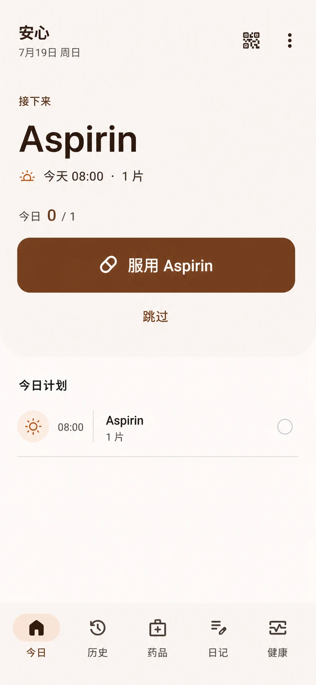
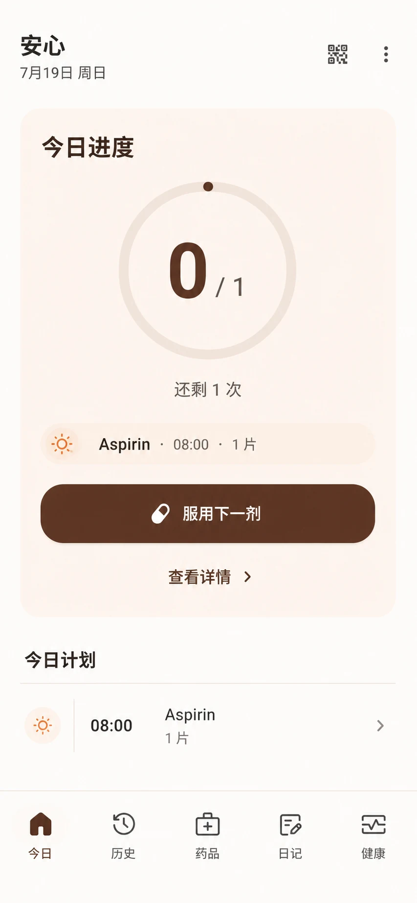
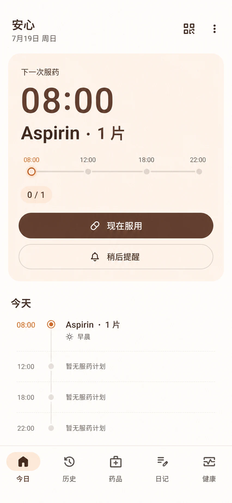
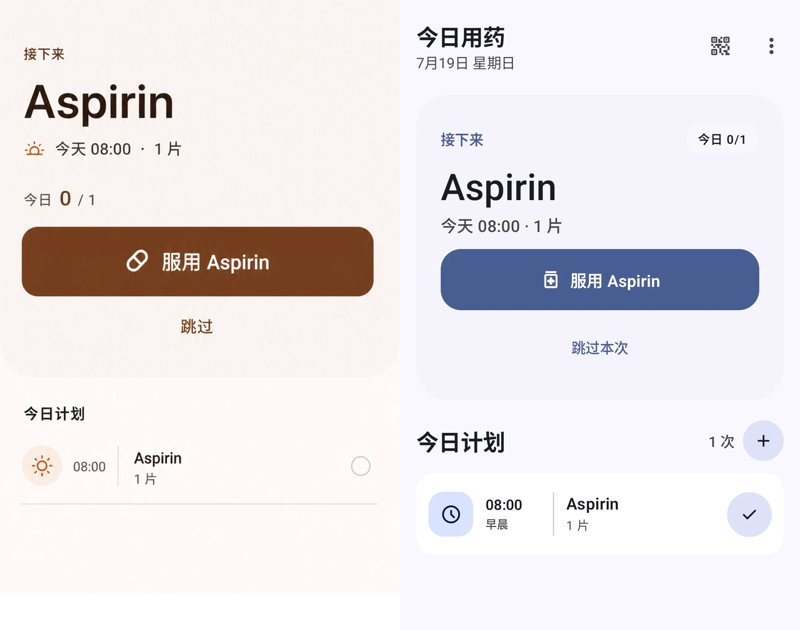
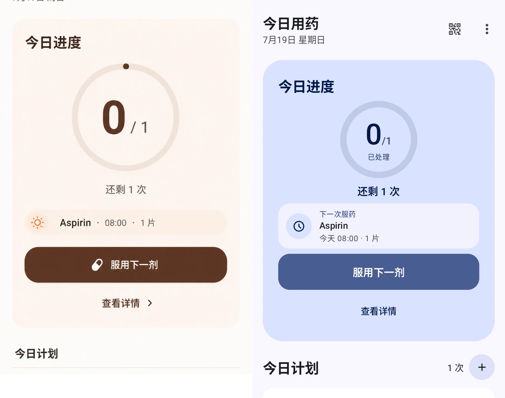
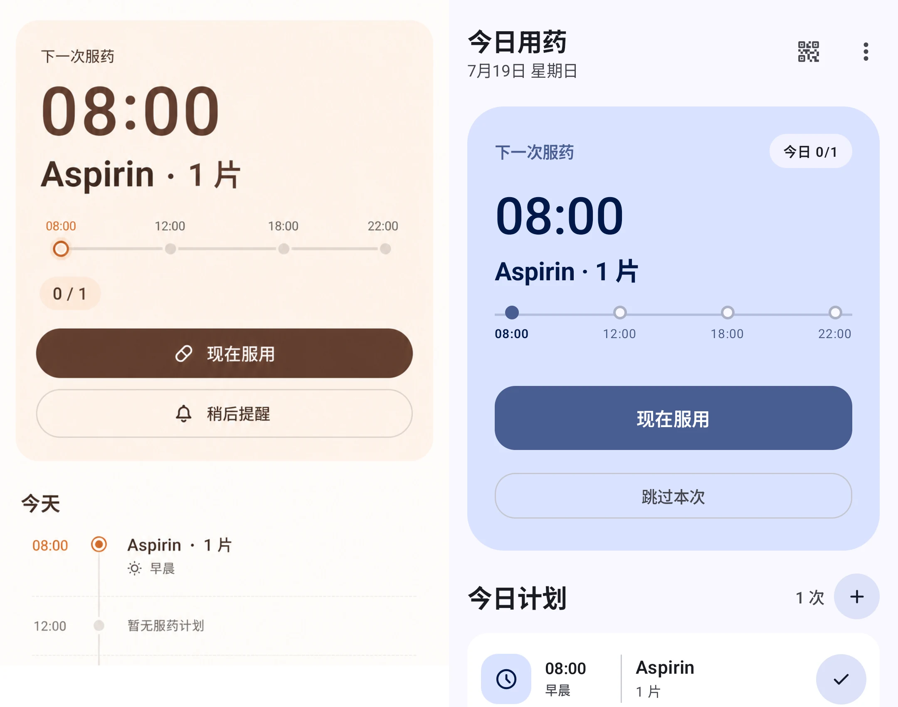

# 首页 Hero 三种样式

完成时间：2026-07-19
验证视口：390 × 844 dp，简体中文
范围：Action、Progress、Timeline 三种可选 Hero，以及它们与“今日计划”的交互层次

## 目标与结果

本轮保留三种视觉方向，让用户在设置中选择。三种样式共用同一剂量状态模型和动作语义，只改变信息表达方式：

- **Action**：突出下一剂及立即操作。
- **Progress**：突出今日已处理数量与剩余任务。
- **Timeline**：把下一剂放进稳定的日内时间上下文。

最终 QA 解决了以下问题：

- 移除会遮挡服药操作的首页悬浮添加按钮，将添加入口放到计划标题旁。
- Hero 负责下一剂主动作；计划区将同一剂量降为紧凑详情行，避免重复按钮。
- 统一“已服、跳过、部分服用”为已处理进度，同时保留各自的事实状态。
- Progress 强化已处理数量，并让下一剂摘要使用完整宽度。
- Timeline 使用 08:00、12:00、18:00、22:00 稳定锚点，并避免实际剂量与锚点出现双点。
- 设置列表改为惰性布局，降低长页面在低内存设备上的首帧压力。

三种样式均通过固定视口截图复核和 Compose 设备交互测试；本范围没有遗留的 P0、P1 或 P2 设计问题。

## 设计基准

| Action | Progress | Timeline |
| --- | --- | --- |
|  |  |  |

## 最终对比

每张图左侧为设计基准，右侧为 Android 实现。Material You 动态配色和产品标题属于有意保留的产品差异。

| Action | Progress | Timeline |
| --- | --- | --- |
|  |  |  |

## 验证边界

低内存 API 35 AVD 在冷启动系统饱和时曾同时出现 System UI、电话进程和应用 JobService ANR；应用主线程当时处于可运行的 Compose 布局阶段，而非锁等待或 I/O 阻塞。温启动复测未产生新 ANR。因此它被记录为模拟器容量与性能跟进项，不属于本轮视觉或交互缺陷。

需要重新生成证据时，应使用固定视口重跑 Compose/ADB 截图；不要提交中间迭代图、布局转储或录屏。
