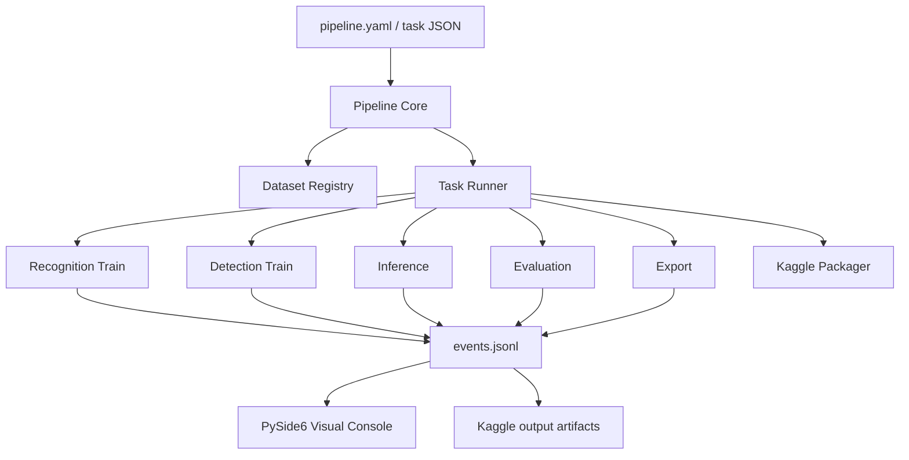

# Unified Seven-Segment OCR Pipeline Design

## Goal

Build one training and inference pipeline that can run in two modes:

1. Local desktop mode with a PySide6 visual console for dataset inspection, training, inference, and report comparison.
2. Headless Kaggle mode with the same task definitions, deterministic outputs, and JSON/JSONL progress events.

The core rule is: GUI is only an observer/controller. Training, inference, export, and evaluation must live in reusable headless modules so Kaggle kernels can run the same pipeline without PySide6.

## Current State

Existing reusable pieces:

- `generate_data.py`: synthetic recognition data.
- `generate_detection_data.py`: synthetic LCD detection data.
- `train.py`: legacy CRNN/classifier training, currently prints human text and saves `.pth`.
- `train_fastvit_ctc.py`: FastViT CTC training, already emits per-epoch JSON rows and writes `fastvit_t8_ctc_report.json`.
- `kaggle_domain_adaptation_kernel/kaggle_domain_adaptation.py`: Kaggle-compatible LightSVTR domain adaptation with `training_history.json`, `evaluation_report.json`, runtime report, and JSON epoch rows.
- `kaggle_candidate_finetune_kernel/kaggle_candidate_finetune.py`: Kaggle-compatible multi-candidate fine-tuning.
- `run_candidate_evaluation.py` and `ocr_model_eval.py`: unified candidate evaluation JSON schema.
- `external_datasets/`: downloaded third-party sources and manifests. BP/Oximeter have device bboxes only; HF 7SEG has sequence OCR ground truth; Kaggle YOLO has digit bbox labels.

Main gaps:

- No single pipeline config describing data, task, model, training, export, and evaluation.
- Training progress events are inconsistent across scripts.
- Legacy CRNN and detection generation do not emit machine-readable progress.
- PySide6 visualization does not exist yet.
- Kaggle kernels are standalone scripts, not generated from a shared task spec.

## Architecture



### Layer 1: Pipeline Core

New package:

```text
seven_segment_ocr/pipeline/
  __init__.py
  schema.py
  events.py
  datasets.py
  tasks.py
  runners.py
  artifacts.py
  kaggle.py
  cli.py
```

Responsibilities:

- Parse and validate pipeline configs.
- Resolve local/Kaggle paths.
- Create run directories.
- Emit JSONL events.
- Call task adapters for existing scripts.
- Write final `run_report.json`.

The core package must depend only on standard Python plus already-used training dependencies. It must not import PySide6.

### Layer 2: Task Adapters

Each subtask gets a stable adapter:

| Adapter | Existing source | Output |
| --- | --- | --- |
| `dataset.inspect` | external dataset manifests, PIL, XML/YOLO/CSV readers | dataset profile, preview images |
| `dataset.prepare_recognition` | HF labels, synthetic generator, domain-adaptation layout | `images/`, `labels.csv`, split manifest |
| `dataset.prepare_detection` | VOC/YOLO conversion, synthetic detection generator | YOLO `data.yaml` |
| `train.light_crnn` | `train.py` refactor | checkpoints, training history |
| `train.light_svtr_domain` | `kaggle_domain_adaptation.py` refactor or subprocess adapter | ONNX, history, eval report |
| `train.fastvit_ctc` | `train_fastvit_ctc.py` | ONNX, history, eval report |
| `train.yolo_lcd` | `kaggle_detection_train.py` | `.pt`, ONNX, metrics |
| `eval.ocr_candidates` | `run_candidate_evaluation.py` | unified eval JSON/table |
| `infer.single_image` | ONNX Runtime + display/digit postprocessors | image overlays, predictions JSON |
| `export.android_assets` | existing ONNX export/dequant/reparameterize scripts | app-ready ONNX artifacts |
| `kaggle.package` | kernel metadata + task config | Kaggle kernel directory |
| `kaggle.fetch_outputs` | Kaggle CLI | downloaded output directory |

Adapters can initially execute existing scripts as subprocesses and parse their outputs. Over time, training functions should receive an optional `event_writer` callback to avoid fragile stdout parsing.

### Layer 3: PySide6 Visual Console

New GUI package:

```text
seven_segment_ocr/pipeline_ui/
  app.py
  main_window.py
  models.py
  worker.py
  widgets/
    dataset_panel.py
    training_panel.py
    inference_panel.py
    evaluation_panel.py
    artifact_panel.py
    kaggle_panel.py
```

The GUI talks to the pipeline through:

- A `QProcess` or worker thread that runs `python -m pipeline.cli ...`.
- A file watcher over `events.jsonl`.
- Artifact readers for `run_report.json`, `training_history.json`, `evaluation_report.json`, prediction JSON, and preview images.

The GUI must not call PyTorch training loops directly on the UI thread.

## Pipeline Config

Use YAML for humans, converted to JSON internally for Kaggle.

```yaml
schema_version: 1
run:
  name: hf_7seg_fastvit_smoke
  output_dir: runs/hf_7seg_fastvit_smoke
  seed: 42
  environment: local

datasets:
  recognition:
    kind: image_text
    root: external_datasets/preprocessed/hf_7seg_ocr
    labels: labels.csv
    image_column: image_path
    label_column: text
    split_column: split
  detection:
    kind: yolo
    root: external_datasets/extracted/kaggle_seven_segment_yolov5
    data_yaml: data.yaml

tasks:
  - id: inspect_recognition_data
    type: dataset.inspect
    dataset: recognition
    preview_count: 32

  - id: train_fastvit
    type: train.fastvit_ctc
    dataset: recognition
    params:
      stage1_epochs: 1
      stage2_epochs: 1
      batch_size: 8
      pretrained: false

  - id: evaluate_candidates
    type: eval.ocr_candidates
    dataset: recognition
    depends_on: [train_fastvit]
    params:
      candidate_config: model_candidates.json
      limit: 200
      batch_size: 8
```

Kaggle conversion should write the same config to `/kaggle/working/pipeline_task.json` with input roots rewritten to `/kaggle/input/...` when dataset sources are attached.

## Event Contract

Every task writes newline-delimited JSON to:

```text
<run_dir>/events.jsonl
```

Base event:

```json
{
  "schema_version": 1,
  "run_id": "20260523_ocr_001",
  "task_id": "train_fastvit",
  "task_type": "train.fastvit_ctc",
  "phase": "train",
  "event": "metric",
  "time": "2026-05-23T08:00:00Z",
  "payload": {}
}
```

Required event types:

| Event | Purpose | Example payload |
| --- | --- | --- |
| `task_started` | task entered queue/execution | params, resolved paths |
| `task_progress` | deterministic progress when known | current, total, unit |
| `metric` | train/eval scalar metrics | epoch, loss, exact, cer, lr |
| `sample_preview` | visual examples | image_path, label, prediction, bbox |
| `artifact` | output file created | path, role, mime/type |
| `warning` | recoverable issue | code, message |
| `task_finished` | completed task | status, duration_seconds |
| `task_failed` | failed task | error_type, message |

Training JSON rows currently printed by FastViT and domain adaptation should be wrapped into `metric` events.

## Artifact Layout

Each run should be self-contained:

```text
seven_segment_ocr/runs/<run_name>/
  pipeline_task.yaml
  pipeline_task.json
  events.jsonl
  run_report.json
  logs/
    stdout.log
    stderr.log
  data/
    previews/
    prepared/
  train/
    checkpoints/
    history.json
  inference/
    predictions.json
    overlays/
  eval/
    results.json
    results.txt
  export/
    model.onnx
    metadata.json
  kaggle/
    kernel/
    output/
```

This same layout should be used locally and on Kaggle. Kaggle outputs are then downloaded into `runs/<run_name>/kaggle/output/`.

## Visual Subtasks

### 1. Dataset Inspection

PySide6 views:

- Dataset summary table: samples, label type, splits, classes, missing files.
- Preview grid:
  - image-text samples: image plus ground-truth text.
  - YOLO/VOC samples: image with bbox overlay and class label.
- Label distribution plots:
  - OCR character frequency.
  - sequence length histogram.
  - detection class counts.

Kaggle compatibility:

- Headless task writes `dataset_profile.json` and preview images.
- GUI renders those artifacts locally or after `kaggle kernels output`.

### 2. Training

PySide6 views:

- Live loss/accuracy/CER curves.
- Current epoch, batch, ETA, device, GPU memory if available.
- Recent error examples: truth, prediction, image crop.
- Checkpoint timeline.

Kaggle compatibility:

- Training emits the same `metric` events to `events.jsonl`.
- Kaggle output includes `training_history.json` and `evaluation_report.json`.
- GUI can open a local run or imported Kaggle output.

### 3. Inference

PySide6 views:

- Image viewer with display bbox, digit bboxes, decoded sequence, confidence.
- Step-by-step pipeline:
  1. original image
  2. device/display detection
  3. crop/rectify/preprocess
  4. OCR logits/decoded text
  5. metric parser output, such as SYS/DIA/PUL or SpO2/PR when available
- Batch inference table with thumbnails.

Kaggle compatibility:

- Headless inference writes `predictions.json` and overlay images.
- GUI reads those outputs; no GUI code is needed on Kaggle.

### 4. Evaluation

PySide6 views:

- Candidate comparison table from `run_candidate_evaluation.py`.
- Exact / normalized exact / CER / digit accuracy / latency charts.
- Confusion and error browser.
- Model capacity and latency panel.

Kaggle compatibility:

- Same `results.json` and `results.txt` schema as current evaluator.

### 5. Kaggle Operations

PySide6 views:

- Kernel task builder: choose base task, dataset sources, accelerator, internet on/off.
- Push/status/output buttons wrapping Kaggle CLI.
- Remote run status and downloaded artifact browser.

Kaggle compatibility:

- Generated kernel must be script-only and not import PySide6.
- Kernel metadata must be generated from the task spec.
- Dataset source mapping must be explicit:

```yaml
kaggle:
  kernel_id: tiiann/seven-segment-ocr-pipeline
  accelerator: NvidiaTeslaT4
  enable_internet: true
  dataset_sources:
    - owner/dataset-slug
  input_mounts:
    recognition: /kaggle/input/my-recognition-dataset
```

## Kaggle Strategy

The shared pipeline should support three Kaggle modes:

1. `package`: create a Kaggle kernel directory from `pipeline_task.yaml`.
2. `push`: run `kaggle kernels push -p <kernel_dir> --accelerator ...`.
3. `fetch`: run `kaggle kernels output <kernel_id> -p <run_dir>/kaggle/output`.

Generated kernel layout:

```text
runs/<run_name>/kaggle/kernel/
  kernel-metadata.json
  kaggle_pipeline_entry.py
  pipeline_task.json
  medlog_ocr_modules/
    pipeline/
    train_fastvit_ctc.py
    ocr_model_eval.py
    ...
```

`kaggle_pipeline_entry.py` should:

1. Add `medlog_ocr_modules/` to `sys.path`.
2. Load `pipeline_task.json`.
3. Rewrite any local roots using `kaggle.input_mounts`.
4. Run `pipeline.cli run --config pipeline_task.json`.
5. Write outputs under `/kaggle/working/<run_name>/`.

Do not include PySide6 in Kaggle kernels.

## Data Compatibility Rules

Recognition datasets must normalize to:

```csv
filename,label,split,source
images/<file>.png,123.4,train,hf_7seg_ocr
```

Current `ocr_model_eval.load_labeled_dataset()` requires `filename` plus `label` or `text`, and checks `root/filename` or `root/images/filename`. The current HF export uses `image_path`; it should be converted to a runner-compatible recognition manifest before training/evaluation.

Detection datasets must normalize to YOLO:

```text
images/
labels/
data.yaml
```

VOC device bboxes from BP/Oximeter should become detection datasets only for device-level tasks. They are not OCR text ground truth.

## Implementation Phases

### Phase 1: Headless Contract

- Add `pipeline/schema.py`, `events.py`, `artifacts.py`, and `cli.py`.
- Add tests for config parsing, event writing, and run directory creation.
- Add `pipeline inspect --config ...` that profiles datasets and writes previews.

### Phase 2: Recognition Training Adapters

- Wrap `train_fastvit_ctc.train_fastvit_ctc()` as `train.fastvit_ctc`.
- Add a runner-compatible dataset normalizer for HF `labels.csv`.
- Add event emission for epoch metrics.
- Refactor legacy `train.py` to optionally emit JSON events.

### Phase 3: Evaluation And Inference

- Wrap `run_candidate_evaluation.py`.
- Add single-image and batch inference tasks.
- Generate overlay artifacts for visual debugging.

### Phase 4: PySide6 Console

- Build the main window, run browser, dataset panel, training curves, inference viewer, and artifact panel.
- Use `QProcess` for local runs and a JSONL file watcher for live updates.
- Keep the GUI read-only against training internals.

### Phase 5: Kaggle Packager

- Generate Kaggle kernel directories from the same task config.
- Add push/status/fetch wrappers.
- Support imported Kaggle outputs in the PySide6 console.

### Phase 6: Detection Tasks

- Normalize VOC device bboxes to YOLO for device detector training.
- Wrap synthetic LCD detection and Kaggle YOLO digit detection.
- Add detection overlays and mAP summaries.

## Design Decisions

- Use JSONL events instead of direct Qt signals from training code. This makes local GUI and Kaggle outputs share one protocol.
- Use YAML/JSON task specs instead of hard-coded GUI forms. The GUI edits task specs; Kaggle consumes task specs.
- Keep PySide6 out of the core and out of Kaggle kernels.
- Keep each run immutable after completion. New parameters create a new run directory.
- Treat BP/Oximeter data as device detection data, not OCR ground truth.

## Immediate Next Steps

1. Add pipeline schema/events tests.
2. Implement `pipeline.cli inspect` for the four downloaded datasets.
3. Add a recognition normalizer that converts HF `image_path,text` into `filename,label,split,source`.
4. Wrap FastViT training with event emission.
5. Create the PySide6 shell that can open an existing run and render `events.jsonl` plus artifacts.
